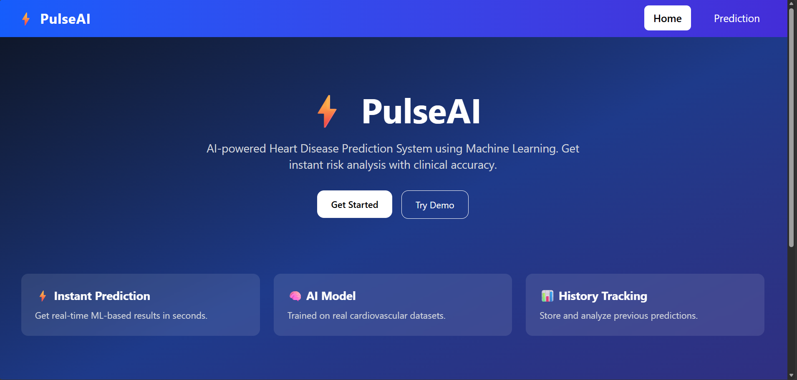
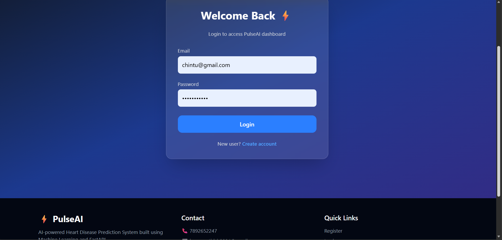
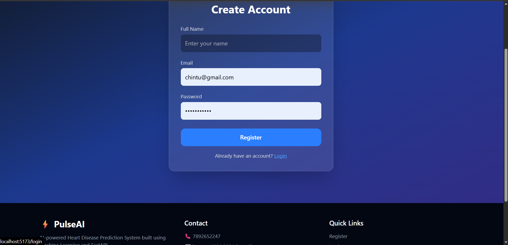
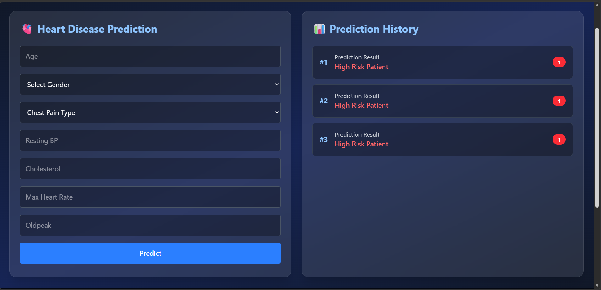

# 🫀 PulseAI – Heart Disease Prediction System

PulseAI is a full-stack AI-powered web application that predicts the risk of heart disease using Machine Learning.  
It includes authentication, prediction history tracking, and a modern React UI with a FastAPI backend and MySQL database.

---

## 🚀 Tech Stack

### Frontend

- React (Vite)
- Tailwind CSS
- Zustand (State Management)

### Backend

- FastAPI
- SQLAlchemy
- MySQL
- Scikit-learn (ML Model)

---

## ✨ Features

- 🔐 User Registration & Login
- 🧠 AI-based Heart Disease Prediction
- 📊 Prediction History Storage
- 👤 User-specific data tracking
- ⚡ Fast API response
- 🎨 Modern responsive UI

---

## 📸 Screenshots

### 1️⃣ Home Page



---

### 2️⃣ Login Page



---

### 3️⃣ Register page



---

### 4️⃣ Prediction and Section



---

## ⚙️ Installation & Setup

### 1. Clone the repository

```bash
git clone https://github.com/your-username/pulseai.git
cd pulseai
```
